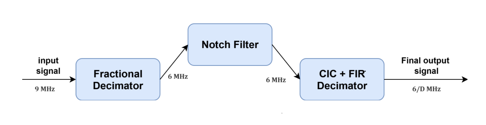
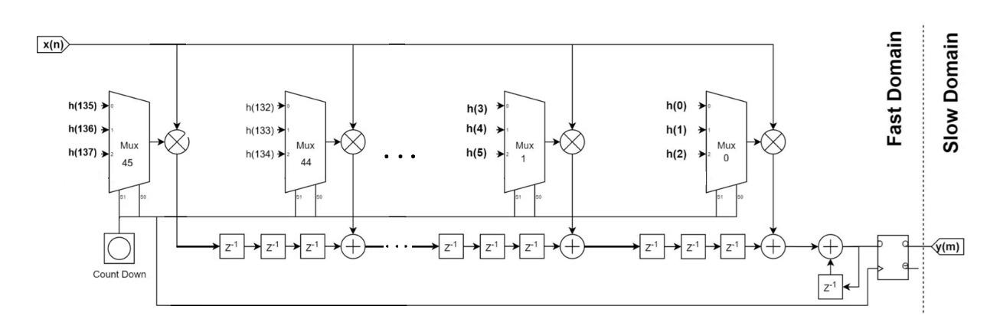
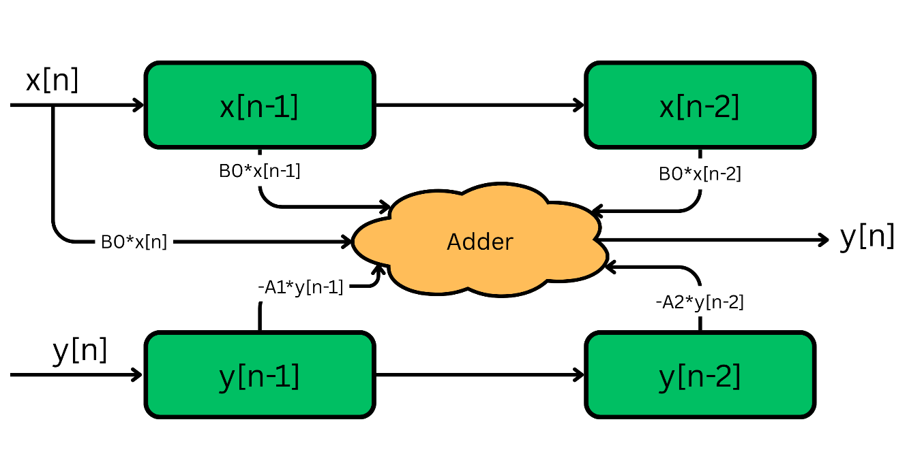
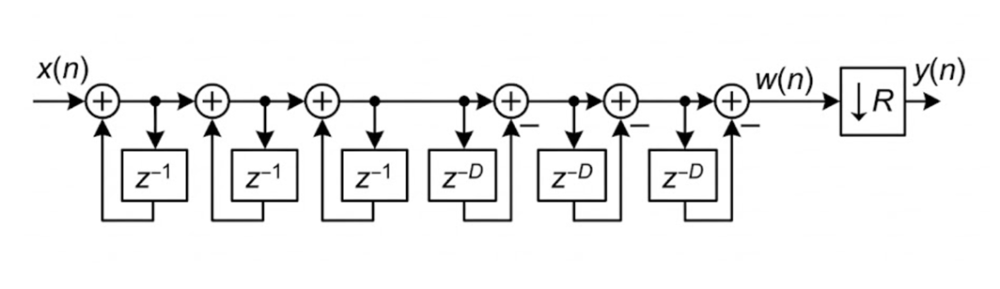
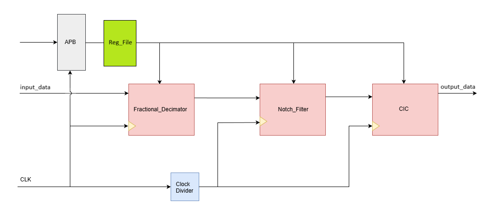

# 📡 Digital Front-End (DFE) System

>  **A Digital Front-End block designed for sampling rate conversion and interference suppression on FPGA platforms.**

## System Block Diagram
<p align="center">
    
    <br>
    <em>Figure 1: System Blocks</em>
</p>

## 📝 Table of Contents

- Overview

- Repository Structure

- System Architecture

  - Fractional Decimator

  - Notch Filter

  - CIC Filter

- Interfaces & Registers

- FPGA Implementation

- Installation & Simulation

- Team Members
---

## 📖 Overview

This repository contains the RTL implementation and verification environment for a Digital Front-End (DFE) system. The system processes a **9 MHz** input signal to produce a output at **6/D MHz** where D is the CIC decimation factor, while suppressing narrowband interference at specific frequencies.


Key features include:

* **Multi-stage Decimation:**  using Polyphase and CIC structures.
* **Interference Suppression:** Configurable IIR Notch filters for removing narrowband noise at 2 MHz and 2.4 MHz.


* **APB Interface:** Standard AMBA APB bus for runtime configuration of coefficients and decimation factors.


---

## 📂 Repository Structure

```bash
├── DOC/                  # Documentation
│   └── images/           # Architecture diagrams and waveforms
├── Model/                # Python Golden Model for verification
├── RTL/                  # Verilog Source Code
├── RTL_with_APB/         # Verilog Source Code wrapped with APB Interface
├── FPGA_Flow/            # Vivado scripts
└── README.md             # Project Documentation

```

---

## 🛠 System Architecture

The DFE pipeline consists of three cascaded stages.

### 1. Fractional Decimator
* **Function:** Function: Resamples the 9 MHz input to 6 MHz ($L=2, M=3$).
* **Architecture:** Transposed Polyphase FIR Filter.

    <p align="center">
        
        <br>
        <em>Figure 2: Fractional Decimator Architecture</em>
    </p>

---
### 2. Notch Filter
* **Function:** Removes narrowband interference at 2 MHz and 2.4 MHz.

* **Architecture:** Cascaded IIR filters in Direct Form II..

    <p align="center">
        
        <br>
        <em>Figure 3: Notch Filter Architecture</em>
    </p>

---

### 3. CIC Filter
* **Function:** Variable down-sampling of the 6 MHz signal.

* **Decimation Factors ($D$)**: Runtime selectable: 1, 2, 4, 8, 16.

* **Architecture:** 3-stage Integrator-Comb.
    <p align="center">
        
        <br>
        <em>Figure 4: CIC Filter Architecture</em>
    </p>


---

## 🔌 Interfaces & Registers

The system is wrapped with an **AMBA APB** interface for control.


<p align="center">
    
    <br>
    <em>Figure 5: System with APB Interface</em>
</p>


### Register Map (32-bit Width)

| Register | Name |  Bits  | Description |
| ------ | -------- | --------- | ----------------------------------- |
| **R0** | `CTRL`   | `[0:4]`   | Block Enable                        |
|        |          | `[5:8]`   | Block Bypass                        |
|        |          | `[9:11]`  | CIC Decimation Factor               |
|        |          | `[12:31]` | (Reserved)             |
| **R1** | `STATUS` | --------- | (Reserved for Status)               |
| **R2** | `COEFF1` | `[31:0]`  | Notch_1 Coeff B0, B1                |
| **R3** | `COEFF2` | `[31:0]`  | Notch_1 Coeff B2, A1                |
| **R4** | `COEFF3` | `[31:0]`  | Notch_1 Coeff A2,  Notch_2 Coeff B0 |
| **R5** | `COEFF4` | `[31:0]`  | Notch_2 Coeff B1, B2                |
| **R6** | `COEFF5` | `[31:0]`  | Notch_2 Coeff A1, A2                |

---

## 📊 FPGA Implementation

The design was synthesized using **Xilinx Vivado**.

| Metric | Result | Notes |
| ------------------- | ------------- | -------------------------- |
| **Total Power**     | **0.253 W**   |  -                         |
| **DSP Blocks**      |**59**         |  -                         |
| **Slice LUTs**      | **1288**      |  -                         |
| **Slice Registers** | **3384**      |  -                         |
| **Timing (WNS)**    | **25.654 ns** | Positive slack (Setup met) |


---
## 🚀 Installation & Simulation

### Prerequisites

* **Simulation Tools:** Python, and Questasim .
* **Synthesis Tools:** Xilinx Vivado.


### Clone the Repository

```bash
git clone https://github.com/Abdo61086/Digital-Front-End-DFE-.git
cd Digital-Front-End-DFE-
```

### Running the Python Model :

```bash
cd Model
# Choose between Fixed-Point or Floating-Point models
cd Model_Fixed_Point # (or) Model_Float

#Install Required Packages
pip install -r requirements.txt

# Run the Model
python main.py
```
> 🗂️ Output figures will be stored in the `Model_Output/` folder.


### RTL Simulation :

Run the testbench located in the `RTL` folder.

```bash
cd RTL_with_APB
vsim -do run.do
```

## 👥 Team Members

**Digitrons Team**  Supervised by **Eng. Eslam Mahmoud**
* Abdulrahman Saad Samhoud 

* Ahmed Ibrahim Hassan Ibrahim 

* Mahmoud Ismail Mahmoud Abdallah 

* Mohamed Ahmed Mohamed Elsayed 

* Moheb Mikhael Heshmat